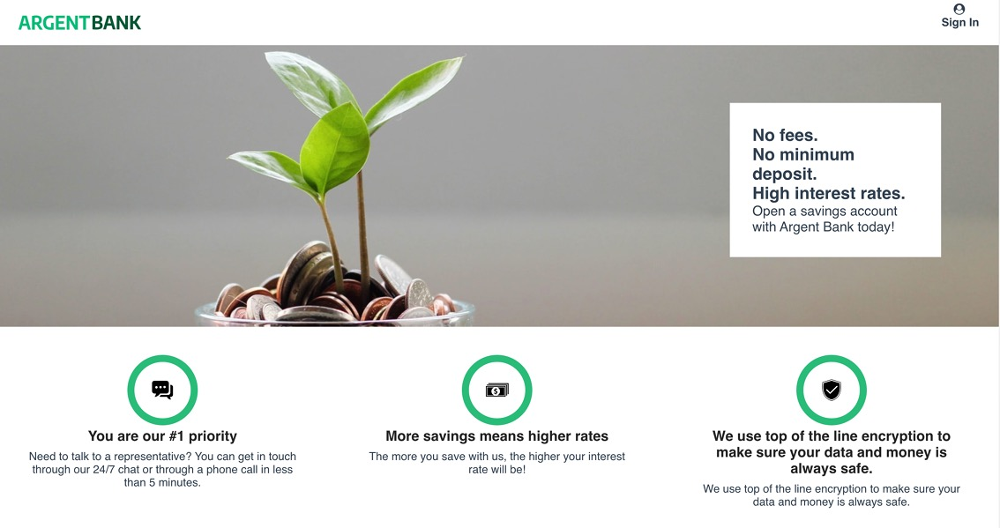
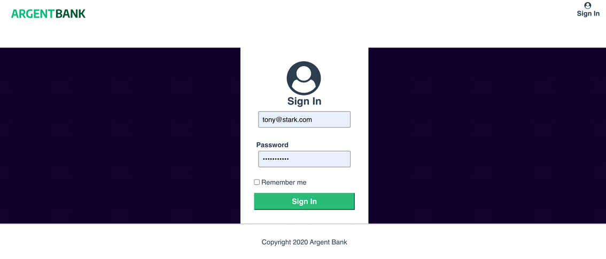
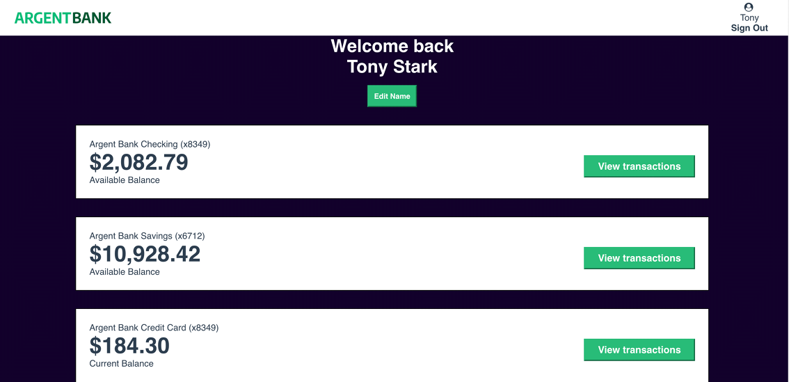
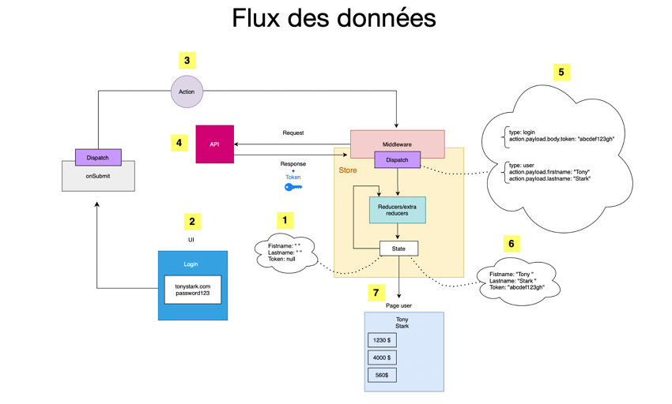

# Project 13 "Argent Bank" from React JS Application Developer Training.
Use an API for a bank user account with React.
##

##
Remede Agency is an agency specialized in the development of web applications.<br/>
##
The project concerns, Argent Bank, a bank. The contract is in two parts which is broken down into several phases:
- Phase 1: User Authentication - Creation of a web application allowing customers to log in and manage their accounts and profile.
- Phase 2: Transactions - This would be to specify the API endpoints needed for a possible second mission once we have completed the first.
##
**Skills developed:**
- Implement a state manager in a react application
- Interact with an API
- Model an API
- Authenticate to an API
- Implementation of the "remember me" option which allows to maintain the connection of a user when refreshing the page.
##
No online versions available for the moment, this project is only functional with a local installation of the back.
## Installing the back end

### Prerequisites

Argent Bank uses the following tech stack:

- [Node.js v12](https://nodejs.org/en/)
- [MongoDB Community Server](https://www.mongodb.com/try/download/community)

Please make sure you have the right versions and download both packages. You can verify this by using the following commands in your terminal:

```bash
# Check Node.js version
node --version

# Check Mongo version
mongo --version
```

### Instructions
1. Forke the repository :https://github.com/OpenClassrooms-Student-Center/Project-10-Bank-API (this codebase contains the code needed to run the backend for Argent Bank).
1. Clone the repo onto your computer
1. Open a terminal window in the cloned project
1. Run the following commands:

```bash
# Install dependencies
npm install

# Start local dev server
npm run dev:server
# Populate database with two users
npm run populate-db
```

Your server should now be running at http://locahost:3001 and you will now have two users in your MongoDB database!

## Populated Database Data

Once you run the `populate-db` script, you should have two users in your database:

### Tony Stark

- First Name: `Tony`
- Last Name: `Stark`
- Email: `tony@stark.com`
- Password: `password123`

### Steve Rogers

- First Name: `Steve`,
- Last Name: `Rogers`,
- Email: `steve@rogers.com`,
- Password: `password456`

## API Documentation

To learn more about how the API works, once you have started your local environment, you can visit: http://localhost:3001/api-docs

## Application overview

### Home page:



### Login page:



### Profil page:



### Datas flow:


